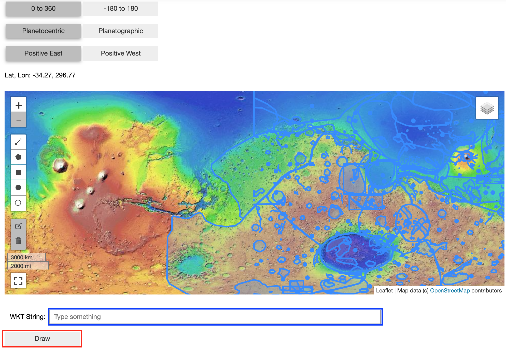

User Manual
============
Below is the user manual for the CartoCosmos Jupyter Notebooks planetary maps viewer.

Prerequisites
=============

This application is made for and supported by Jupyter Notebooks.

Components
==========

**The Console**

- (red) ⇒ Longitude and Latitude Buttons
- (yellow) ⇒ Under-Cursor Coordinate Display

.. image:: imgs/ControlsM.png

**The Map**

- (red) ⇒  Zoom Control
- (blue) ⇒ Enter Full-Screen Mode
- (yellow) ⇒ Layer Switcher
- (yellow) ⇒ Draw Control

.. image:: imgs/mapM.png

**Draw Well-Known text strings**

- (red) ⇒  Draw Button
- (blue) ⇒ Input Box

Instructions
============

**How to Create a Map:**

In a new cell in the notebook, copy the lines:

.. code:: python

    map = l.planetary_maps('mars')
    map.display_map()

This will create and display a map viewing images of Mars. To change the target of the map, just change the name being passed into l.planetary_maps(). 

**How to Control Map Movement:**

To change the active viewing location displayed within the map there are two options:

- Using your mouse: 
    - left-click then drag to pull the map in all directions

- Using your keyboard: 
    - use the arrow keys (up, down, left, and right) to move the map in all directions

**How to Zoom In/Out:**

To view the map in more detail or from farther away, there are two ways to zoom in and out of the map:

- Using the scroll functionality with your mouse or trackpad:
    - Scroll up to zoom in
    - Scroll down to zoom out

- Using the Zoom Control:
    - "+" to zoom in
    - "-" to zoom out

**How to Enter/Exit Full-Screen:**

Leaflet-Planetary offers the functionality to display the map across an entire monitor. 
 
- To enter full-screen mode:
    - Click the Full-Screen button 
- To exit full-screen mode:
    - Press ‘ESC’ key on your keyboard

**How to Change the Active Layer Displayed on the Map:**

For certain bodies, there are multiple layers to choose between that offer different types of imaging from satellites equipped with the technology.  To change the active layer:

- Using your mouse:
    - Hover over the Layer Switcher
    - Select one of the available options from the dropdown list

**How to Change Longitude Range:**

When viewing a body, there are two options for the longitude range: "-180° to 180°" or "0° to 360°". To select between the two, you can toggle the buttons marked with a "+/- 180° or + 360°" and observe the coordinate display adjusting accordingly.

**How to Change Latitude Coordinate System to Planetographic/Planetocentric:**

Depending on the target body you’re observing, you may need to change the latitude coordinate system to planetographic or planetocentric depending on your use case.  To do this, find the latitude/longitude buttons in the console.  The button reading “Ocentric” is for planetocentric and "Ographic" is for planetographic.

**How to Change Latitude Display to Positive East/West:**

To change the latitude display to present coordinate data in a positive east (increasing to the east) or positive west (increasing to the west), find the latitude/longitude buttons in the console. The button on the left reading “East” will change to positive east, and the button reading “West” will change to positive west

**How to Draw Shapes on the map:**

There are two ways to draw shapes on the planetary maps. You can either use the draw control or the Well-Known text input box.

- Using the draw control
    - First, click on the shape you want to draw. Then click and drag the shape onto the map. The Well-Known text string from the shape you drew on the map will show in the Well-Known input box

- Using Well-Known text strings
    - Enter the Well-Known text string in the input box and click the draw button.

- Using Well-Knwon text Function
    
    .. code:: python

        map.add_wkt("POLYGON ((-187.03125 22.851563, -187.03125 35.15625, -167.34375 35.15625, -167.34375 22.851563, -187.03125 22.851563))")

    This will create a polygon on the map being displayed with the WKT passed in. You can add as many shapes as you please.

